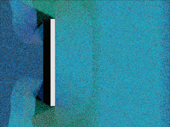

# LatticeGasWeb

WebGL interactive implementation of lattice gas.
All calculations are performed on GPU so it can handle huge
amount of partcles.

Deployed [here](https://www.golova.dev/automata/latticeGas)

Based on skeeto's GOL [project](https://github.com/skeeto/webgl-game-of-life)
Check also his [article](https://nullprogram.com/blog/2014/06/10/) about two
texture approach for a WebGL automata implementation.

Basic rules and coloring borrowed from https://github.com/timhutton/latticegas.
